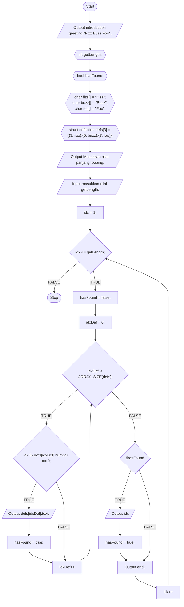

<h1 align="center" style="margin-bottom:0">Fizz Buzz Foo</h1>

Created by <a href="https://github.com/rizalarfiyan/" target="_blank">Rizal Arfiyan</a> by &#10084;
 

Fizz Buzz Foo adalah sebuah mini program untuk menyelesaikan sebuah case, digunakan untuk memenuhi tugas UTS matkul Algoritma dan Pemrograman yang diampu oleh ibu Wiwi Widayani, M.Kom.

## The Case
Write a program that prints the numbers from input (positive integer provided by the user). But for multiples of three, print "Fizz" instead of the number, for the multiples of five, print "Buzz", and for the multiples of seven, print "Foo". For numbers which are multiples of both three and five, print "FizzBuzz", three and seven, print "FizzFoo", five and seven, print "BuzzFoo", and three, five, seven print "FizzBuzzFoo".

## Flow Chart
